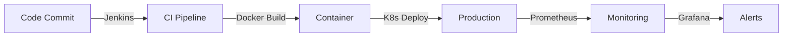
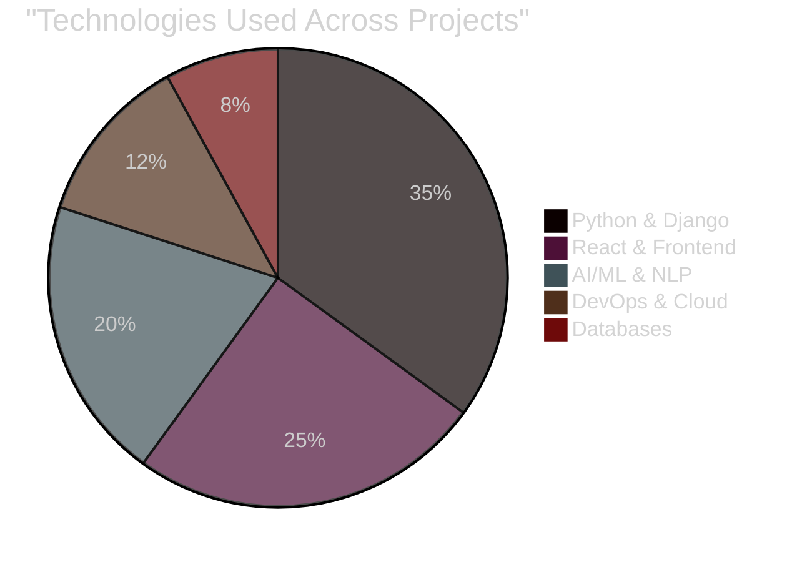
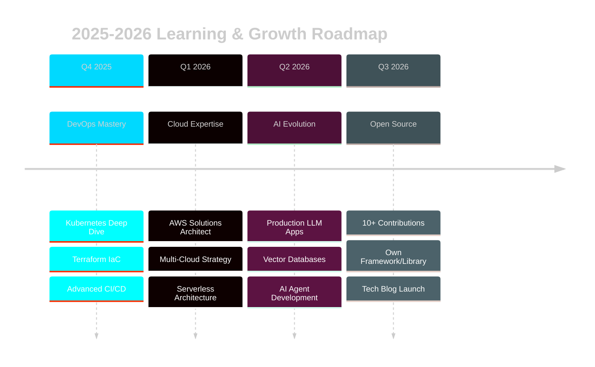

<div align="center">

<!-- ANIMATED HEADER WITH MATRIX EFFECT -->


<!-- TERMINAL-STYLE INTRO -->
```bash
┌──(tejas@machine)-[~/github/profile]
└─$ ./introduce.sh

> Initializing profile...
> Loading expertise... ████████████████████ 100%
> Deploying innovation... ✓
> Status: READY TO BUILD AMAZING THINGS

 ┌─────────────────────────────────────────────┐
 │  "Code is poetry, DevOps is the rhythm,    │
 │   and AI is the future we're creating"      │
 └─────────────────────────────────────────────┘
```

<div>
  <a href="mailto:tejaspavithra2002@gmail.com">
    
  </a>
  <a href="https://www.linkedin.com/in/tejasgowda-t-064b41283">
    
  </a>
  <a href="https://github.com/Tejas1024">
    
  </a>
  <a href="https://kypaauui.manus.space/">
    
  </a>
  <a href="tel:+918296082806">
    
  </a>
</div>

<br>

<!-- DYNAMIC TYPING EFFECT -->


<!-- PROFILE VIEWS WITH CUSTOM STYLE -->


</div>

<br>

---

<!-- HOLOGRAPHIC DIVIDER -->


<br>

## 🎯 SYSTEM STATUS: ONLINE & DEPLOYING

<div align="center">

<!-- 3D ROTATING STATS -->
| ⚡ **METRIC** | 📊 **STATUS** | 🎯 **ACHIEVEMENT** |
|:---:|:---:|:---:|
| **Manual Work Reduced** |  | **80% Faster** |
| **Recruitment Screening** |  | **70% Improved** |
| **Job Match Accuracy** |  | **85% Precision** |
| **Research Time** |  | **Hours → Seconds** |

</div>

<br>

<!-- ANIMATED DIVIDER -->


<br>

## 🚀 MISSION CONTROL: WHO AM I?

<table>
<tr>
<td width="60%" valign="top">

### 👨‍💻 **The Developer**

```yaml
name: "Tejas Gowda T R"
location: "Bangalore, Karnataka 🇮🇳"
education: "Master of Computer Applications (2025)"
role: |
  Full Stack Developer +
  AI/ML Engineer +
  DevOps Enthusiast
  
current_mission:
  - Building AI-powered platforms
  - Automating cloud infrastructure  
  - Creating scalable web applications
  - Optimizing CI/CD pipelines

philosophy: |
  "If it takes more than 10 seconds,
   automate it. If it can be smarter,
   add AI. If it can scale better,
   use the cloud."

success_metrics:
  manual_reduction: "80%+"
  code_quality: "Production-Grade"
  learning_mode: "Always ON"
  coffee_intake: "∞"
```

</td>
<td width="40%" valign="top">

### 🎮 **Power-Ups Unlocked**

```javascript
const achievements = {
  🏢 experience: "1+ years",
  💼 internships: 2,
  🚀 projects: "20+",
  🎓 certifications: 5,
  ⭐ github_stars: "Growing",
  🔥 streak: "Active",
  
  superpowers: [
    "⚡ Rapid Prototyping",
    "🤖 AI Integration",
    "☁️ Cloud Architecture", 
    "🔄 DevOps Automation",
    "📊 Data Engineering",
    "🎨 UI/UX Design"
  ],
  
  activeBuffs: {
    learning: "Kubernetes & LLMs",
    building: "DevOps Pipelines",
    exploring: "Cloud Native Apps"
  }
};
```

<div align="center">

</div>

</td>
</tr>
</table>

<br>

<!-- GLITCH EFFECT DIVIDER -->


<br>

## 💼 ACTIVE DEPLOYMENTS: EXPERIENCE

<div align="center">

### 🔧 **CURRENT: DevOps Engineer @ Robowaves**
**`Jun 2025 - Present`** `|` **Building the Future of Infrastructure**

<table>
<tr>
<td align="center" width="50%">

**🛠️ OPERATIONS**


</td>
<td align="center" width="50%">

**📊 TECH STACK**
```yaml
tools:
  ci_cd: Jenkins, GitHub Actions
  containers: Docker, Kubernetes
  cloud: AWS (EC2, S3, IAM)
  monitoring: Prometheus, Grafana
  scripting: Shell, Python
  os: Linux (Ubuntu, RHEL)
```

</td>
</tr>
</table>

**🎯 Key Wins:**
- ⚙️ Built automated CI/CD pipelines reducing deployment time by 60%
- 🐳 Containerized 10+ applications with Docker + Kubernetes orchestration
- ☁️ Managed AWS infrastructure with 99.9% uptime
- 📊 Implemented monitoring solutions catching issues before users do

</div>

---

<div align="center">

### 🐍 **COMPLETED: Python Full Stack @ Pentagon Space**
**`Oct 2024 - Apr 2025`** `|` **6-Month Intensive Bootcamp**

<details>
<summary><b>🔽 Click to View Full Training Path</b></summary>

<br>

| **PHASE** | **MODULES** | **OUTCOME** |
|:---:|---|:---:|
| **Phase 1** | Core Python, OOP, DSA | ✅ Fundamentals Mastered |
| **Phase 2** | Django, REST APIs, PostgreSQL | ✅ Backend Expert |
| **Phase 3** | ReactJS, Redux, TailwindCSS | ✅ Frontend Pro |
| **Phase 4** | MongoDB, Redis, Celery | ✅ Advanced Concepts |
| **Phase 5** | Real-world Projects | ✅ Production Ready |

**🏆 Achievements:**
- Built 8+ full-stack applications from scratch
- Mastered REST API design patterns
- Deployed production-grade e-commerce platform
- Scored 95%+ in all assessments

**📜 [View Certificate](https://drive.google.com/file/d/1ByVQcJFvOfw2fyrP3IWOCNgUkIvqnFUB/view?usp=sharing)**

</details>

</div>

<br>

<!-- TECH WAVE DIVIDER -->


<br>

## ⚔️ WEAPONS ARSENAL: TECH STACK

<div align="center">

<!-- ANIMATED SKILL BARS -->
### 🔥 **PROFICIENCY LEVELS**

| **CATEGORY** | **TECHNOLOGIES** | **LEVEL** |
|:---|:---|:---:|
| **Languages** | Python • JavaScript • SQL • Bash |  |
| **Frontend** | React • Streamlit • TailwindCSS • HTML/CSS |  |
| **Backend** | Django • FastAPI • REST APIs • GraphQL |  |
| **Databases** | PostgreSQL • MongoDB • MySQL • Redis |  |
| **DevOps** | Docker • K8s • Jenkins • AWS • Terraform |  |
| **AI/ML** | TensorFlow • scikit-learn • NLP • LLMs |  |

</div>

<br>

<div align="center">

<!-- TECH STACK WITH ICONS -->
### 💻 **THE COMPLETE TOOLKIT**

<table>
<tr>
<td align="center" width="20%">
<br>
<sub><b>Backend Power</b></sub>
</td>
<td align="center" width="20%">
<br>
<sub><b>Frontend Magic</b></sub>
</td>
<td align="center" width="20%">
<br>
<sub><b>DevOps Arsenal</b></sub>
</td>
<td align="center" width="20%">
<br>
<sub><b>Data Storage</b></sub>
</td>
<td align="center" width="20%">
<br>
<sub><b>Dev Tools</b></sub>
</td>
</tr>
<tr>
<td align="center" width="20%">
<br>
<sub><b>AI/ML Stack</b></sub>
</td>
<td align="center" width="20%">
<br>
<sub><b>UI Frameworks</b></sub>
</td>
<td align="center" width="20%">
<br>
<sub><b>Monitoring</b></sub>
</td>
<td align="center" width="20%">
<br>
<sub><b>CI/CD Tools</b></sub>
</td>
<td align="center" width="20%">
<br>
<sub><b>Scripting</b></sub>
</td>
</tr>
</table>

</div>

<br>

<!-- MATRIX RAIN DIVIDER -->


<br>

## 🎮 LEGENDARY PROJECTS: PORTFOLIO

<div align="center">

<!-- PROJECT SHOWCASE WITH CARDS -->

<table>
<tr>
<td width="50%" valign="top">

### 🤖 **Personal AI Advisor**
[](https://personal-ai-advisor-ftulhqxgxxn6jspu8xxw6f.streamlit.app/)

**LLM-Powered Document Intelligence**

```python
impact = {
    "time_saved": "hours → seconds",
    "user_type": "non-technical",
    "domains": ["Finance", "Legal", "Healthcare"],
    "magic": "Zero-setup AI deployment"
}
```

**🌟 Features:**
- 🧠 Personalized domain-specific AI advisors
- 📄 Auto document-to-knowledge conversion
- 🔍 Natural language querying
- 🚀 RAG architecture for accuracy

**Tech:** `Python` `Streamlit` `LLM` `RAG` `NLP`

</td>
<td width="50%" valign="top">

### 💰 **Smart Expense Tracker**
[](https://smart-expense-tracker-with-ai-insig-eight.vercel.app/login)

**AI-Powered Financial Management**

```javascript
const results = {
  manualReduction: "80%",
  features: ["OCR", "ML", "AI Insights"],
  security: "Bank-Grade",
  responsive: true
};
```

**🌟 Features:**
- 📸 OCR receipt scanning
- 🤖 Smart auto-categorization
- 💡 AI budget recommendations
- 📊 Predictive spending analytics

**Tech:** `React` `Django` `OCR` `ML` `PostgreSQL`

</td>
</tr>

<tr>
<td width="50%" valign="top">

### 🎯 **AI Resume Matcher**
[](https://github.com/Tejas1024)

**Intelligent Recruitment Platform**

```yaml
performance:
  screening_speed: "+70%"
  matching_accuracy: "85%"
  profiles_processed: "200+ in seconds"
  algorithm: "TF-IDF + KNN"
```

**🌟 Features:**
- 🔍 Automated resume parsing
- 🎯 Precision job matching
- 🤖 ML-based recommendations
- 📊 Recruiter analytics dashboard

**Tech:** `Python` `NLP` `TF-IDF` `KNN` `MongoDB`

</td>
<td width="50%" valign="top">

### 🛒 **E-Commerce Platform**
[](https://github.com/Tejas1024)

**Full-Stack Shopping Solution**

```json
{
  "features": {
    "user": "Browse, Cart, Checkout, Track",
    "admin": "Products, Orders, Analytics",
    "auth": "JWT + Role-based",
    "mobile": "Fully Responsive"
  }
}
```

**🌟 Features:**
- 🛍️ Complete shopping flow
- 👨‍💼 Admin dashboard
- 🔒 Secure authentication
- 📊 Real-time analytics

**Tech:** `Django` `React` `PostgreSQL` `REST API`

</td>
</tr>

<tr>
<td width="50%" valign="top">

### 🤖 **Nexus RAG Chatbot**
[](https://nexus-rag-chatbot.streamlit.app)

**Cyberpunk AI Assistant**

```css
.features {
  ui: "Futuristic Glassmorphism";
  formats: ["PDF", "DOCX", "CSV", "JSON"];
  access: "Role-Based (Admin/User)";
  ai: "Local + Cloud Hybrid";
}
```

**🌟 Features:**
- 🎨 Animated holographic UI
- 📄 Multi-format document support
- 🔐 Secure document management
- 🧠 Context-aware responses

**Tech:** `Streamlit` `scikit-learn` `HuggingFace`

</td>
<td width="50%" valign="top">

### 🌾 **Smart Agri Planner**
[](https://github.com/Tejas1024)

**Multi-Language Farmer Support**

```python
accessibility = {
    "languages": 6,  # Indian languages
    "data_driven": True,
    "visual_analytics": "Charts + Graphs",
    "offline_reports": "CSV Export"
}
```

**🌟 Features:**
- 🌍 6 Indian language support
- 🎯 Soil & climate-based recommendations
- 💰 ROI calculator
- 🐛 Pest risk analysis

**Tech:** `Streamlit` `Pandas` `Plotly` `SQLite`

</td>
</tr>
</table>

<!-- PROJECT METRICS -->
### 📊 **PROJECT IMPACT SUMMARY**



</div>

<br>

<!-- FUTURISTIC DIVIDER -->


<br>

## 🏆 ACHIEVEMENT UNLOCKED: CERTIFICATIONS

<div align="center">

<table>
<tr>
<td align="center" width="33%">

<br><b>🎓 Python Full Stack</b>
<br><i>Pentagon Space Pvt. Ltd</i>
<br><sub>6-Month Intensive Training</sub>
<br><a href="https://drive.google.com/file/d/1ByVQcJFvOfw2fyrP3IWOCNgUkIvqnFUB/view?usp=sharing">

</a>
</td>
<td align="center" width="33%">

<br><b>⚡ JavaScript</b>
<br><i>HackerRank</i>
<br><sub>Advanced Proficiency</sub>
<br><a href="https://drive.google.com/file/d/1C8icroWne4_SB4-gcmklA-VVBCyC-ljS/view?usp=sharing">

</a>
</td>
<td align="center" width="33%">

<br><b>🐍 Python Advanced</b>
<br><i>Scaler Topics</i>
<br><sub>Deep Dive Mastery</sub>
<br><a href="https://drive.google.com/file/d/1CAYpVV8WD7GeZVkIiDDcXfoQm1H8uDYd/view?usp=sharing">

</a>
</td>
</tr>
<tr>
<td align="center" width="33%">

<br><b>📊 Data Structures</b>
<br><i>Scaler Topics</i>
<br><sub>Algorithms & Optimization</sub>
<br><a href="https://drive.google.com/file/d/1CB5kOAOWv1LaGPMlgKzokwDnqK_Na8uY/view?usp=sharing">

</a>
</td>
<td align="center" width="33%">

<br><b>🔧 DevOps Engineering</b>
<br><i>Robowaves</i>
<br><sub>Hands-on Experience (Ongoing)</sub>
<br>
</td>
<td align="center" width="33%">

<br><b>☁️ Cloud Architecture</b>
<br><i>AWS (Target: Q1 2026)</i>
<br><sub>Currently Preparing</sub>
<br>
</td>
</tr>
</table>

</div>

<br>

<!-- DIGITAL RAIN DIVIDER -->


<br>

## 📈 LIVE METRICS: GITHUB ANALYTICS

<div align="center">

<!-- ADVANCED STATS GRID -->


<!-- LANGUAGE BREAKDOWN -->


<!-- ACTIVITY GRAPH -->


<!-- TROPHY SHOWCASE -->


</div>

<!-- CONTRIBUTION SNAKE -->
<div align="center">
  <picture>
    <source media="(prefers-color-scheme: dark)" srcset="https://raw.githubusercontent.com/Tejas1024/Tejas1024/output/github-contribution-grid-snake-dark.svg">
    <source media="(prefers-color-scheme: light)" srcset="https://raw.githubusercontent.com/Tejas1024/Tejas1024/output/github-contribution-grid-snake.svg">
    
  </picture>
</div>

<br>

<!-- ELECTRIC DIVIDER -->


<br>

## 🎯 MISSION OBJECTIVES: CURRENT FOCUS

<div align="center">

<!-- ROADMAP VISUALIZATION -->


</div>

<br>

<table>
<tr>
<td width="50%" valign="top">

### 🚀 **CURRENTLY LEARNING**

```yaml
devops_track:
  kubernetes:
    - Pod orchestration & scaling
    - Service mesh (Istio)
    - Helm charts
    - CKA certification prep
  
  infrastructure:
    - Terraform deep dive
    - AWS CloudFormation
    - Ansible automation
    - GitOps workflows
  
  monitoring:
    - Prometheus + Thanos
    - Grafana dashboards
    - ELK stack mastery
    - Distributed tracing

ai_ml_track:
  llm_engineering:
    - RAG architectures
    - Vector databases (Pinecone, Weaviate)
    - Prompt engineering
    - Fine-tuning models
  
  deployment:
    - Model serving (TorchServe)
    - A/B testing frameworks
    - ML pipeline automation
    - Cost optimization
```

</td>
<td width="50%" valign="top">

### 🎯 **2025-2026 GOALS**

```python
class Goals2025:
    def __init__(self):
        self.certifications = [
            "☁️ AWS Solutions Architect",
            "🐳 Kubernetes CKA",
            "🔐 AWS Security Specialty"
        ]
        
        self.contributions = {
            "open_source": "10+ meaningful PRs",
            "tech_blog": "24+ articles",
            "youtube": "Start tech channel",
            "mentorship": "Help 50+ developers"
        }
        
        self.projects = [
            "Build SaaS product",
            "Create npm/pip package",
            "Launch AI-powered tool",
            "Contribute to CNCF"
        ]
        
        self.skills = {
            "master": ["K8s", "Terraform", "LLMs"],
            "learn": ["Rust", "Go", "WebAssembly"],
            "improve": ["System Design", "Scalability"]
        }
        
    def execute(self):
        print("🚀 Mission started. No turning back!")
        return "Success guaranteed with persistence"
```

**📊 Progress Tracking:**
- ✅ DevOps fundamentals mastered
- 🔄 Kubernetes certification (60% complete)
- 🔄 AWS Solutions Architect (preparing)
- 📈 Open source contributions started
- 🎯 Building production LLM apps

</td>
</tr>
</table>

<br>

<!-- NEON DIVIDER -->


<br>

## 💡 WHAT MAKES ME DIFFERENT

<div align="center">

<table>
<tr>
<td width="25%" align="center">

### ⚡ **SPEED**


**80%** reduction in manual processes

Optimized workflows from hours to seconds

Rapid prototyping & deployment

</td>
<td width="25%" align="center">

### 🎯 **PRECISION**


**85%** AI matching accuracy

Production-grade code quality

Detail-oriented solutions

</td>
<td width="25%" align="center">

### 🚀 **INNOVATION**


AI-powered platforms built from scratch

Bleeding-edge tech adoption

Creative problem solving

</td>
<td width="25%" align="center">

### 🎓 **GROWTH**


Continuous learning mindset

**1+ year** intensive training

Always exploring new tech

</td>
</tr>
</table>

</div>

<br>

<!-- COMPETITIVE EDGE TABLE -->
<div align="center">

### 🔥 **THE COMPETITIVE EDGE**

| **TRAIT** | **EVIDENCE** | **IMPACT** |
|:---|:---|:---:|
| 🧠 **Problem Solver** | Built AI tools for non-technical users | ⭐⭐⭐⭐⭐ |
| 🏗️ **Architect** | Designed scalable, secure applications | ⭐⭐⭐⭐⭐ |
| 🤖 **AI Enthusiast** | Integrated LLMs into production apps | ⭐⭐⭐⭐⭐ |
| ☁️ **Cloud Native** | AWS + Docker + K8s deployment expert | ⭐⭐⭐⭐⭐ |
| 🔄 **DevOps Focused** | CI/CD pipelines reducing deploy time 60% | ⭐⭐⭐⭐⭐ |
| 📚 **Fast Learner** | Mastered full-stack + DevOps in 1 year | ⭐⭐⭐⭐⭐ |
| 🤝 **Team Player** | Collaborative, communicative, adaptable | ⭐⭐⭐⭐⭐ |
| 💪 **Persistent** | Never stops until problem is solved | ⭐⭐⭐⭐⭐ |

</div>

<br>

<!-- HOLOGRAPHIC DIVIDER -->


<br>

## 🌐 CONNECT WITH ME: LET'S BUILD TOGETHER

<div align="center">

<!-- 3D CONTACT CARDS -->
<table>
<tr>
<td align="center" width="20%">
<a href="mailto:tejaspavithra2002@gmail.com">

<br><br>

</a>
<br><sub>tejaspavithra2002@gmail.com</sub>
</td>
<td align="center" width="20%">
<a href="https://www.linkedin.com/in/tejasgowda-t-064b41283">

<br><br>

</a>
<br><sub>Let's network!</sub>
</td>
<td align="center" width="20%">
<a href="https://github.com/Tejas1024">

<br><br>

</a>
<br><sub>Check my code</sub>
</td>
<td align="center" width="20%">
<a href="https://kypaauui.manus.space/">

<br><br>

</a>
<br><sub>See my work</sub>
</td>
<td align="center" width="20%">
<a href="tel:+918296082806">

<br><br>

</a>
<br><sub>+91 8296082806</sub>
</td>
</tr>
</table>

<br>

### 💼 **OPEN TO OPPORTUNITIES**


```javascript
const opportunities = {
  fullTime: [
    "Full Stack Developer",
    "Backend Engineer (Python/Django)",
    "DevOps Engineer",
    "Cloud Engineer (AWS)",
    "AI/ML Engineer"
  ],
  
  freelance: [
    "Web Application Development",
    "API Design & Integration",
    "DevOps Consulting",
    "AI/ML Solutions",
    "Cloud Migration"
  ],
  
  openSource: [
    "Contributing to CNCF projects",
    "Building developer tools",
    "Documentation improvements",
    "Code reviews & mentoring"
  ],
  
  interests: [
    "Startup culture",
    "Remote-first companies",
    "Tech innovation hubs",
    "Social impact projects"
  ]
};

console.log("📩 Let's discuss how I can add value to your team!");
```

<br>

<!-- INTERACTIVE STATS -->
### 📊 **RESPONSE TIME GUARANTEE**

| **PLATFORM** | **RESPONSE TIME** | **AVAILABILITY** |
|:---:|:---:|:---:|
| 📧 **Email** | < 24 hours |  |
| 💼 **LinkedIn** | < 12 hours |  |
| 📱 **Phone** | < 6 hours |  |
| 🐙 **GitHub** | < 48 hours |  |

</div>

<br>

<!-- ENERGY WAVE DIVIDER -->


<br>

## 🎮 FUN FACTS & PERSONALITY

<div align="center">

<table>
<tr>
<td width="50%" valign="top">

### 🎯 **DEVELOPER PERSONALITY**

```javascript
const tejasDNA = {
  workStyle: {
    methodology: "Agile + DevOps",
    codeQuality: "Clean Code Advocate",
    testing: "TDD Believer",
    documentation: "Always Updated",
    debugging: "console.log() Champion 🏆"
  },
  
  productivity: {
    bestTimeToCode: "Night Owl 🦉",
    fuelSource: "Coffee ☕ (Infinite Loop)",
    musicChoice: "Lo-fi Beats 🎵",
    favoriteIDE: "VS Code + Vim Motions",
    motto: "Make it work → Make it right → Make it fast"
  },
  
  philosophy: {
    principle: "Automate everything possible",
    belief: "AI should empower, not replace",
    goal: "Build tools that help people",
    dream: "Make complex tech accessible to all"
  },
  
  quirks: [
    "Can't start coding without coffee",
    "Refactors code before sleeping",
    "Dreams in Python and JavaScript",
    "Has more GitHub repos than photos",
    "Reads error messages like poetry 😅"
  ]
};
```

</td>
<td width="50%" valign="top">

### 🎨 **WHEN NOT CODING...**

```python
class LifeBalance:
    def __init__(self):
        self.hobbies = {
            "🚀 Tech": [
                "Exploring new frameworks",
                "Reading tech blogs",
                "Watching conference talks",
                "Contributing to open source"
            ],
            "📚 Learning": [
                "System design courses",
                "Cloud architecture patterns",
                "AI research papers",
                "DevOps best practices"
            ],
            "🎯 Relaxation": [
                "Sci-fi movies & shows",
                "Strategy games",
                "Tech podcasts",
                "Nature walks 🌲"
            ],
            "🤝 Community": [
                "Helping on Stack Overflow",
                "Mentoring juniors",
                "Writing tutorials",
                "Tech meetups"
            ]
        }
    
    def daily_routine(self):
        return """
        ☕ Morning: Coffee + Code review
        💻 Day: Build & Deploy
        🌙 Evening: Learn new tech
        🌃 Night: Side projects
        """
    
    def fun_fact(self):
        return "I once debugged for 6 hours " \
               "only to find a missing semicolon. " \
               "Best learning experience ever! 😂"
```

### 🏆 **ACHIEVEMENT STATS**


</td>
</tr>
</table>

</div>

<br>

<!-- CYBER DIVIDER -->


<br>

## 📝 LATEST BLOG POSTS & CONTENT

<div align="center">

<!-- Blog placeholder - update with actual links -->
### ✍️ **SHARING KNOWLEDGE**

> *"The best way to learn is to teach others"*

<table>
<tr>
<td align="center" width="33%">

<br><b>Coming Soon!</b>
<br>
<i>📝 Tech Blog Launch</i>
<br>
<sub>Articles on DevOps, AI/ML, and Full-Stack Development</sub>
</td>
<td align="center" width="33%">

<br><b>YouTube Channel</b>
<br>
<i>🎥 In Planning</i>
<br>
<sub>Tutorials, Project Walkthroughs, Tech Tips</sub>
</td>
<td align="center" width="33%">

<br><b>Open Source Docs</b>
<br>
<i>📚 Contributing</i>
<br>
<sub>Improving documentation for better developer experience</sub>
</td>
</tr>
</table>

<!-- GitHub Activity -->
### 📈 **RECENT ACTIVITY**

<!--START_SECTION:activity-->
<!-- This section will auto-update with GitHub Actions -->
<!--END_SECTION:activity-->

</div>

<br>

<!-- MATRIX DIVIDER -->


<br>

## 💭 DEVELOPER WISDOM

<div align="center">

<table>
<tr>
<td align="center">

### 📜 **QUOTES I CODE BY**


<br>


<br>


</td>
</tr>
</table>

</div>

<br>

<!-- ANIMATED SIGNATURE -->
<div align="center">

### ⚡ **THE TEJAS EFFECT**

```ascii
╔═══════════════════════════════════════════════════════════╗
║                                                           ║
║   "I don't just write code, I craft experiences."       ║
║                                                           ║
║   🎯 Mission: Transform complex ideas into elegant       ║
║       solutions that make a real-world impact            ║
║                                                           ║
║   💡 Vision: Empower everyone with intelligent           ║
║       technology, regardless of technical background     ║
║                                                           ║
║   🚀 Goal: Build the future, one commit at a time       ║
║                                                           ║
╚═══════════════════════════════════════════════════════════╝
```

</div>

<br>

<!-- SUPPORT SECTION -->
<div align="center">

### ☕ **SUPPORT MY WORK**

<table>
<tr>
<td align="center" width="33%">

<br><b>⭐ Star My Repos</b>
<br>
<sub>Show appreciation for my work</sub>
</td>
<td align="center" width="33%">

<br><b>🔀 Fork & Contribute</b>
<br>
<sub>Let's build together</sub>
</td>
<td align="center" width="33%">

<br><b>📢 Share My Work</b>
<br>
<sub>Spread the word</sub>
</td>
</tr>
</table>

<br>

### 🌟 **IF MY WORK HELPED YOU**

[](https://github.com/Tejas1024)
[](https://github.com/Tejas1024)

<sub>Every ⭐ motivates me to create more awesome projects!</sub>

</div>

<br>

<!-- FINAL CALL TO ACTION -->
<div align="center">

---

### 🚀 **READY TO COLLABORATE?**


```typescript
interface Collaboration {
  project: string;
  role: "Full Stack" | "DevOps" | "AI/ML" | "Consulting";
  duration: "Full-time" | "Contract" | "Freelance";
  startDate: Date;
}

const letsConnect: Collaboration = {
  project: "Your Next Big Idea",
  role: "Full Stack", // or any role!
  duration: "Full-time",
  startDate: new Date("ASAP")
};

// 📩 Send me a message and let's make it happen!
console.log("tejaspavithra2002@gmail.com");
```

<br>

<a href="mailto:tejaspavithra2002@gmail.com">
  
</a>
<a href="https://www.linkedin.com/in/tejasgowda-t-064b41283">
  
</a>
<a href="https://kypaauui.manus.space/">
  
</a>

</div>

<br>

---

<div align="center">

### 💖 **THANK YOU FOR VISITING!**


```python
while True:
    code()
    learn()
    build()
    repeat()
    
print("See you in the next commit! 👋")
```

<sub>⚡ Powered by passion, fueled by coffee, driven by curiosity</sub>

<br>

<!-- VISITOR COUNTER -->


</div>

<!-- FOOTER WAVE -->

